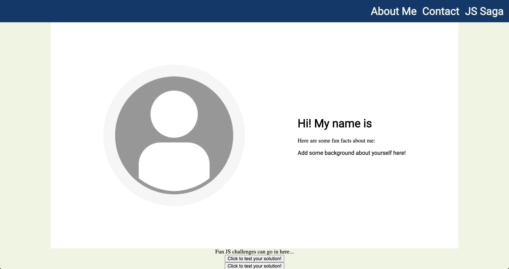
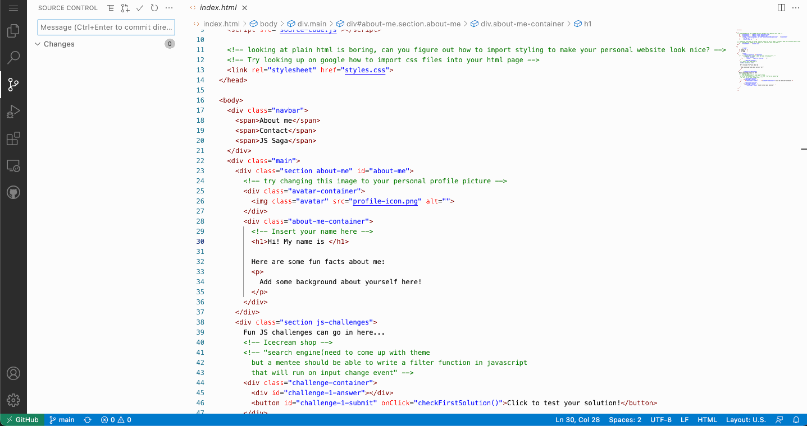
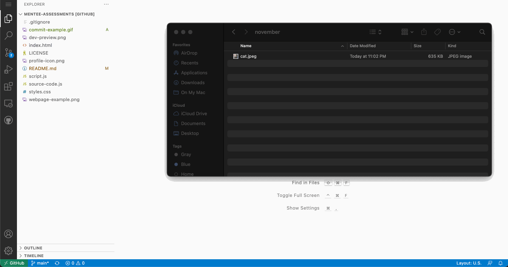

# Mentee Accessment

Goal of this activity is to access mentee's skills and find the right placement in the Emergent Works' program.

This activity involves learning basic GitHub features and modifying HTML, CSS, and Javascript code.

1. [Create a GitHub account](https://github.com/signup). You will need an email and a strong password. If you already have a GitHub account, feel free to login with your existing account. 
2. Fork this repository. This means you will create a copy of this repository for your account. If you're wondering what a repository is, [a repository contains all of your project's files and each file's revision history](https://docs.github.com/en/repositories/creating-and-managing-repositories/about-repositories). Figure out how to fork a repository by following the instructions [here](https://docs.github.com/en/get-started/quickstart/fork-a-repo#forking-a-repository).
3. Once you have forked the repository, GitHub will create a GitHub page and generate a domain to host the site. For example, [this](https://emergentworks.github.io/mentee-assessments/) is where the original repository is hosted. Find the domain of your version of the repo by going to `https://emergentworks.github.io/mentee-assessments` except replacing `emergentworks` with your GitHub username. The webpage should look something like this: 
4. Good job! You are pass the digital literacy section of this assessment. These next steps will challenge your knowledge in modifying HTML and using VCS (Version Control System).
5. The homepage of this website is outlined in the [index.html](/index.html) file. We are going to edit this file by using GitHub's virtual code editor. You can access the editor by simply going to your repo and click `.`. This will open a page that looks like this: . If you do not see this, you can try going to `https://emergentworks.github.io/mentee-assessments` but replace `emergentworks` with your GitHub username.
6. Once there, click on the `index.html` file. You should see the editor open a file that starts with `<!DOCTYPE html>`. Look for the line that says `<h1>Hi! My name is </h1>` and add your name before the closing tag (i.e. `</h1>`). To publish your change (aka commit and push your change), you will need to go to the source control tab and add the file, commit with a message, and push the commit to your `main` branch. Luckily, as long you follow the screenshot below, you will be able to do all of these things within the virtual editor: . Wait a couple seconds and you will be able to see your name on your website!
7. Go back to `index.html` and find the line that says `Add some background about yourself here!`. Replace that line with a fun fact about yourself. Then, repeat the same process of pushing your change by going the source control tab, adding the file, typing a commit message, and then clicking the checkmark icon. The message can be `add fun fact`
8. Let's try replacing the empty profile picture with either a picture of yourself or something you like. This step will be left for you to figure out. Try googling `how to add image HTML`. If you would like to add an image to your repository, you can simply drag the file in. For exmaple: . Be sure to commit and push your changes in order to see it on your website.
9. Congratulations! You have passed the HTML section of this assessment!

# Javascript challenges

You can find all the source code inside script.js file. Use that file to write logic for your functions.

## Challenge 1
 Write a function called sum that returns summation of two numbers

 Example: sum(5, 2) should return 7
